# System Architecture

## Overview

Verida Kurumsal Bilgi Uygulaması modern web teknolojileri kullanarak geliştirilmiş, güvenli ve ölçeklenebilir bir kurumsal bilgi yönetim sistemidir.

## High-Level Architecture

```mermaid
graph TB
    User[👤 User] --> Browser[🌐 Web Browser]
    Browser --> NextJS[⚡ Next.js 15 App]
    NextJS --> Auth[🔐 NextAuth.js]
    NextJS --> API[📡 API Routes]
    API --> Prisma[🔧 Prisma ORM]
    Prisma --> DB[(🗄️ PostgreSQL)]
    NextJS --> Files[📁 File Storage]
    
    subgraph "Frontend Layer"
        Browser
        NextJS
    end
    
    subgraph "Backend Layer"
        Auth
        API
        Prisma
    end
    
    subgraph "Data Layer"
        DB
        Files
    end
```



## Technology Stack

### Frontend
- **Next.js 15**: React framework with App Router
- **React 19**: UI library
- **TypeScript**: Type safety
- **Tailwind CSS**: Utility-first CSS framework
- **React Hook Form**: Form management
- **Zod**: Schema validation

### Backend
- **Next.js API Routes**: Server-side API
- **NextAuth.js**: Authentication system
- **Prisma**: Database ORM
- **PostgreSQL**: Primary database
- **Node.js**: Runtime environment

### Development & Deployment
- **ESLint**: Code linting
- **Prettier**: Code formatting
- **Vitest**: Testing framework
- **Coolify**: Deployment platform

## Application Layers

### 1. Presentation Layer

#### Components Structure
```
src/components/
├── ui/                 # Reusable UI components
│   ├── Button.tsx
│   ├── Input.tsx
│   ├── Modal.tsx
│   └── Badge.tsx
├── auth/              # Authentication components
│   ├── SignInForm.tsx
│   ├── AuthGuard.tsx
│   └── RoleGuard.tsx
├── layout/            # Layout components
│   ├── Header.tsx
│   ├── Sidebar.tsx
│   └── Footer.tsx
└── features/          # Feature-specific components
    ├── users/
    ├── pages/
    └── files/
```

#### Pages Structure (App Router)
```
src/app/
├── layout.tsx         # Root layout
├── page.tsx          # Home page
├── auth/             # Authentication pages
│   ├── signin/
│   ├── error/
│   └── verify-request/
├── admin/            # Admin panel
│   ├── users/
│   ├── settings/
│   └── logs/
├── editor/           # Content management
│   ├── pages/
│   └── files/
└── api/              # API routes
    ├── auth/
    ├── users/
    ├── pages/
    └── health/
```

### 2. Business Logic Layer

#### Authentication & Authorization
```typescript
// Role-based access control
enum UserRole {
  SYSTEM_ADMIN = "SYSTEM_ADMIN",
  ADMIN = "ADMIN", 
  EDITOR = "EDITOR",
  MEMBER = "MEMBER"
}

// Permission hierarchy
SYSTEM_ADMIN > ADMIN > EDITOR > MEMBER
```

#### Core Services
- **UserService**: User management operations
- **PageService**: Content management
- **FileService**: File upload/download
- **NotificationService**: In-app notifications
- **ActivityService**: Audit logging

### 3. Data Access Layer

#### Prisma Schema
```prisma
model User {
  id            String    @id @default(cuid())
  email         String    @unique
  name          String?
  role          UserRole  @default(MEMBER)
  emailVerified DateTime?
  
  // Relations
  pages         Page[]
  files         File[]
  comments      Comment[]
  activityLogs  ActivityLog[]
  
  @@map("users")
}

model Page {
  id        String      @id @default(cuid())
  title     String
  content   String?     @db.Text
  pageType  ContentType
  published Boolean     @default(true)
  
  // Relations
  author    User        @relation(fields: [authorId], references: [id])
  files     File[]
  comments  Comment[]
  
  @@map("pages")
}
```

## Security Architecture

### Authentication Flow


### Authorization Middleware
```typescript
// Route protection
export default withAuth(
  function middleware(req) {
    const { pathname } = req.nextUrl
    const { token } = req.nextauth
    
    // Admin routes
    if (pathname.startsWith('/admin/')) {
      return checkAdminRole(token)
    }
    
    // Editor routes  
    if (pathname.startsWith('/editor/')) {
      return checkEditorRole(token)
    }
  }
)
```

### Data Security
- **Input Validation**: Zod schemas on all inputs
- **SQL Injection Prevention**: Prisma ORM parameterized queries
- **XSS Prevention**: React built-in escaping
- **CSRF Protection**: NextAuth.js built-in protection
- **Domain Restriction**: @dgmgumruk.com email validation

## Database Design

### Entity Relationship Diagram


### Indexing Strategy
```sql
-- Performance indexes
CREATE INDEX idx_users_email ON users(email);
CREATE INDEX idx_users_role ON users(role);
CREATE INDEX idx_pages_author ON pages(authorId);
CREATE INDEX idx_pages_type ON pages(pageType);
CREATE INDEX idx_pages_published ON pages(published);
CREATE INDEX idx_files_uploader ON files(uploadedById);
CREATE INDEX idx_comments_page ON comments(pageId);
CREATE INDEX idx_activity_user ON activity_logs(userId);
```

## API Architecture

### RESTful Design
```
GET    /api/users              # List users
POST   /api/users              # Create user
GET    /api/users/{id}         # Get user
PUT    /api/users/{id}         # Update user
DELETE /api/users/{id}         # Delete user
PUT    /api/users/{id}/role    # Update role

GET    /api/pages              # List pages
POST   /api/pages              # Create page
GET    /api/pages/{id}         # Get page
PUT    /api/pages/{id}         # Update page
DELETE /api/pages/{id}         # Delete page
```

### Response Format
```typescript
// Success response
interface ApiResponse<T> {
  success: true
  data: T
  message?: string
}

// Error response
interface ApiError {
  success: false
  error: string
  details?: ValidationError[]
}

// Paginated response
interface PaginatedResponse<T> {
  data: T[]
  pagination: {
    page: number
    limit: number
    total: number
    totalPages: number
  }
}
```

### Middleware Stack
```typescript
// API middleware chain
Request → Authentication → Authorization → Validation → Handler → Response
```

## File Storage Architecture

### Storage Strategy
```
public/uploads/
├── users/              # User avatars
├── pages/              # Page attachments
│   ├── {pageId}/
│   │   ├── documents/
│   │   └── images/
└── temp/               # Temporary uploads
```

### File Processing Pipeline

```mermaid
graph LR
    Upload[📤 File Upload] --> Validate[✅ Validation]
    Validate --> Scan[🔍 Security Scan]
    Scan --> Store[💾 Store File]
    Store --> DB[📝 Save Metadata]
    DB --> Response[📋 Return Info]
```


## Performance Architecture

### Caching Strategy
- **Static Assets**: Next.js automatic optimization
- **API Responses**: Redis cache (future implementation)
- **Database Queries**: Prisma query optimization
- **Images**: Next.js Image optimization

### Database Optimization
- **Connection Pooling**: Prisma connection pool
- **Query Optimization**: Selective field loading
- **Indexing**: Strategic database indexes
- **Pagination**: Cursor-based pagination for large datasets

## Monitoring & Observability

### Logging Architecture
```typescript
// Structured logging
interface LogEntry {
  level: 'info' | 'warn' | 'error'
  message: string
  timestamp: string
  userId?: string
  action?: string
  metadata?: Record<string, any>
}
```

### Health Monitoring
```typescript
// Health check endpoint
GET /api/health
{
  "status": "healthy",
  "database": "connected", 
  "timestamp": "2024-01-01T00:00:00.000Z",
  "uptime": 3600,
  "version": "1.0.0"
}
```

### Activity Tracking
- **User Actions**: All CRUD operations logged
- **Authentication Events**: Login/logout tracking
- **Permission Changes**: Role modifications
- **System Events**: Errors and warnings

## Deployment Architecture

### Development Environment
```
Developer Machine
├── Node.js 18+
├── PostgreSQL 14+
├── VS Code + Extensions
└── Local file storage
```

### Production Environment (Coolify)
```
Coolify Platform
├── Docker Container
│   ├── Next.js Application
│   ├── Node.js Runtime
│   └── Environment Variables
├── PostgreSQL Database
├── Volume Storage (Files)
└── SSL/TLS Termination
```

### Environment Configuration
```bash
# Development
NODE_ENV=development
DATABASE_URL=postgresql://localhost:5432/verida_dev

# Production  
NODE_ENV=production
DATABASE_URL=postgresql://prod-server:5432/verida_prod
NEXTAUTH_URL=https://verida.dgmgumruk.com
```

## Scalability Considerations

### Horizontal Scaling
- **Stateless Design**: No server-side sessions
- **Database Scaling**: Read replicas for queries
- **File Storage**: CDN for static assets
- **Load Balancing**: Multiple app instances

### Vertical Scaling
- **Database**: Increased CPU/RAM for PostgreSQL
- **Application**: More powerful server instances
- **Storage**: SSD for better I/O performance

### Future Enhancements
- **Microservices**: Split into smaller services
- **Event Sourcing**: For audit trail
- **CQRS**: Separate read/write models
- **Message Queue**: For async processing

## Security Architecture

### Defense in Depth
1. **Network Level**: HTTPS, firewall rules
2. **Application Level**: Input validation, authentication
3. **Database Level**: Encrypted connections, access controls
4. **File System Level**: Restricted permissions, virus scanning

### Compliance
- **KVKK**: Personal data protection
- **ISO 27001**: Information security standards
- **OWASP**: Web application security guidelines

## Integration Points

### External Systems
- **Email Service**: SMTP for notifications (optional)
- **File Scanner**: Antivirus integration (future)
- **LDAP/AD**: Directory integration (future)
- **Backup Service**: Automated backups (future)

### API Integrations
- **Webhook Support**: Event notifications (future)
- **REST API**: Third-party integrations
- **GraphQL**: Flexible data queries (future)

This architecture provides a solid foundation for the Verida Kurumsal Bilgi Uygulaması while maintaining flexibility for future enhancements and scaling requirements.