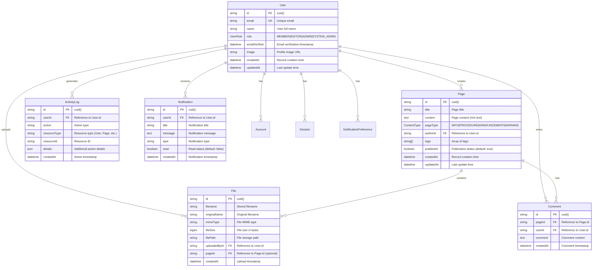

# Database Schema Documentation

## Overview

Verida Kurumsal Bilgi Uygulaması veritabanı şeması dokümantasyonu. PostgreSQL veritabanı kullanılarak tasarlanmış, Prisma ORM ile yönetilmektedir.

## Entity Relationship Diagram



## Table Definitions

### Users Table

**Purpose**: Kullanıcı bilgilerini ve rollerini saklar.

```sql
CREATE TABLE users (
    id TEXT PRIMARY KEY DEFAULT gen_random_uuid(),
    name TEXT,
    email TEXT UNIQUE NOT NULL,
    email_verified TIMESTAMP,
    image TEXT,
    role TEXT NOT NULL DEFAULT 'MEMBER',
    created_at TIMESTAMP NOT NULL DEFAULT NOW(),
    updated_at TIMESTAMP NOT NULL DEFAULT NOW()
);
```

**Indexes**:
```sql
CREATE UNIQUE INDEX users_email_key ON users(email);
CREATE INDEX idx_users_role ON users(role);
CREATE INDEX idx_users_created_at ON users(created_at);
```

**Constraints**:
- `email`: Unique, @dgmgumruk.com domain validation
- `role`: Enum constraint (MEMBER, EDITOR, ADMIN, SYSTEM_ADMIN)

### Pages Table

**Purpose**: İçerik sayfalarını saklar.

```sql
CREATE TABLE pages (
    id TEXT PRIMARY KEY DEFAULT gen_random_uuid(),
    title TEXT NOT NULL,
    content TEXT,
    page_type TEXT NOT NULL,
    author_id TEXT NOT NULL REFERENCES users(id),
    tags TEXT[] DEFAULT '{}',
    published BOOLEAN NOT NULL DEFAULT true,
    created_at TIMESTAMP NOT NULL DEFAULT NOW(),
    updated_at TIMESTAMP NOT NULL DEFAULT NOW()
);
```

**Indexes**:
```sql
CREATE INDEX idx_pages_author_id ON pages(author_id);
CREATE INDEX idx_pages_page_type ON pages(page_type);
CREATE INDEX idx_pages_published ON pages(published);
CREATE INDEX idx_pages_created_at ON pages(created_at);
CREATE INDEX idx_pages_tags ON pages USING GIN(tags);
```

**Constraints**:
- `page_type`: Enum constraint (INFO, PROCEDURE, ANNOUNCEMENT, WARNING)
- `author_id`: Foreign key to users.id with CASCADE delete

### Files Table

**Purpose**: Dosya metadata'sını saklar.

```sql
CREATE TABLE files (
    id TEXT PRIMARY KEY DEFAULT gen_random_uuid(),
    filename TEXT NOT NULL,
    original_name TEXT NOT NULL,
    mime_type TEXT,
    file_size BIGINT NOT NULL,
    file_path TEXT NOT NULL,
    uploaded_by_id TEXT NOT NULL REFERENCES users(id),
    page_id TEXT REFERENCES pages(id),
    created_at TIMESTAMP NOT NULL DEFAULT NOW()
);
```

**Indexes**:
```sql
CREATE INDEX idx_files_uploaded_by_id ON files(uploaded_by_id);
CREATE INDEX idx_files_page_id ON files(page_id);
CREATE INDEX idx_files_created_at ON files(created_at);
CREATE INDEX idx_files_mime_type ON files(mime_type);
```

**Constraints**:
- `file_size`: Maximum 10MB (10,485,760 bytes)
- `mime_type`: Allowed file types validation
- `uploaded_by_id`: Foreign key to users.id
- `page_id`: Optional foreign key to pages.id

### Comments Table

**Purpose**: Sayfa yorumlarını saklar.

```sql
CREATE TABLE comments (
    id TEXT PRIMARY KEY DEFAULT gen_random_uuid(),
    page_id TEXT NOT NULL REFERENCES pages(id) ON DELETE CASCADE,
    user_id TEXT NOT NULL REFERENCES users(id),
    comment TEXT NOT NULL,
    created_at TIMESTAMP NOT NULL DEFAULT NOW()
);
```

**Indexes**:
```sql
CREATE INDEX idx_comments_page_id ON comments(page_id);
CREATE INDEX idx_comments_user_id ON comments(user_id);
CREATE INDEX idx_comments_created_at ON comments(created_at);
```

### Activity Logs Table

**Purpose**: Sistem aktivitelerini ve audit trail'i saklar.

```sql
CREATE TABLE activity_logs (
    id TEXT PRIMARY KEY DEFAULT gen_random_uuid(),
    user_id TEXT NOT NULL REFERENCES users(id),
    action TEXT NOT NULL,
    resource_type TEXT,
    resource_id TEXT,
    details JSONB,
    created_at TIMESTAMP NOT NULL DEFAULT NOW()
);
```

**Indexes**:
```sql
CREATE INDEX idx_activity_logs_user_id ON activity_logs(user_id);
CREATE INDEX idx_activity_logs_action ON activity_logs(action);
CREATE INDEX idx_activity_logs_resource_type ON activity_logs(resource_type);
CREATE INDEX idx_activity_logs_created_at ON activity_logs(created_at);
CREATE INDEX idx_activity_logs_details ON activity_logs USING GIN(details);
```

### Notifications Table

**Purpose**: Kullanıcı bildirimlerini saklar.

```sql
CREATE TABLE notifications (
    id TEXT PRIMARY KEY DEFAULT gen_random_uuid(),
    user_id TEXT NOT NULL REFERENCES users(id) ON DELETE CASCADE,
    title TEXT NOT NULL,
    message TEXT NOT NULL,
    type TEXT NOT NULL,
    read BOOLEAN NOT NULL DEFAULT false,
    created_at TIMESTAMP NOT NULL DEFAULT NOW()
);
```

**Indexes**:
```sql
CREATE INDEX idx_notifications_user_id ON notifications(user_id);
CREATE INDEX idx_notifications_read ON notifications(read);
CREATE INDEX idx_notifications_type ON notifications(type);
CREATE INDEX idx_notifications_created_at ON notifications(created_at);
```

### Notification Preferences Table

**Purpose**: Kullanıcı bildirim tercihlerini saklar.

```sql
CREATE TABLE notification_preferences (
    user_id TEXT PRIMARY KEY REFERENCES users(id) ON DELETE CASCADE,
    in_app_notifications BOOLEAN NOT NULL DEFAULT true,
    updated_at TIMESTAMP NOT NULL DEFAULT NOW()
);
```

## NextAuth.js Tables

### Accounts Table

**Purpose**: OAuth provider hesap bilgilerini saklar.

```sql
CREATE TABLE accounts (
    id TEXT PRIMARY KEY DEFAULT gen_random_uuid(),
    user_id TEXT NOT NULL REFERENCES users(id) ON DELETE CASCADE,
    type TEXT NOT NULL,
    provider TEXT NOT NULL,
    provider_account_id TEXT NOT NULL,
    refresh_token TEXT,
    access_token TEXT,
    expires_at INTEGER,
    token_type TEXT,
    scope TEXT,
    id_token TEXT,
    session_state TEXT,
    UNIQUE(provider, provider_account_id)
);
```

### Sessions Table

**Purpose**: Kullanıcı session'larını saklar.

```sql
CREATE TABLE sessions (
    id TEXT PRIMARY KEY DEFAULT gen_random_uuid(),
    session_token TEXT UNIQUE NOT NULL,
    user_id TEXT NOT NULL REFERENCES users(id) ON DELETE CASCADE,
    expires TIMESTAMP NOT NULL
);
```

### Verification Tokens Table

**Purpose**: Email doğrulama token'larını saklar.

```sql
CREATE TABLE verification_tokens (
    identifier TEXT NOT NULL,
    token TEXT UNIQUE NOT NULL,
    expires TIMESTAMP NOT NULL,
    UNIQUE(identifier, token)
);
```

## Enums

### UserRole Enum
```sql
CREATE TYPE "UserRole" AS ENUM (
    'SYSTEM_ADMIN',
    'ADMIN', 
    'EDITOR',
    'MEMBER'
);
```

**Hierarchy**: SYSTEM_ADMIN > ADMIN > EDITOR > MEMBER

### ContentType Enum
```sql
CREATE TYPE "ContentType" AS ENUM (
    'INFO',
    'PROCEDURE',
    'ANNOUNCEMENT', 
    'WARNING'
);
```

## Data Validation Rules

### Email Validation
- Must end with `@dgmgumruk.com`
- Must be valid email format
- Unique across all users

### File Validation
- Maximum size: 10MB
- Allowed MIME types:
  - `application/pdf`
  - `application/msword`
  - `application/vnd.openxmlformats-officedocument.wordprocessingml.document`
  - `application/vnd.ms-excel`
  - `application/vnd.openxmlformats-officedocument.spreadsheetml.sheet`
  - `image/jpeg`
  - `image/png`
  - `image/gif`
  - `image/webp`

### Content Validation
- Page title: 1-200 characters
- Comment: 1-1000 characters
- User name: 2-100 characters

## Performance Considerations

### Indexing Strategy
1. **Primary Keys**: All tables use CUID for primary keys
2. **Foreign Keys**: Indexed for join performance
3. **Search Fields**: Email, tags, content type indexed
4. **Temporal Data**: Created/updated timestamps indexed
5. **JSON Fields**: GIN indexes for JSONB columns

### Query Optimization
```sql
-- Efficient user lookup
SELECT * FROM users WHERE email = $1;

-- Page listing with author
SELECT p.*, u.name as author_name 
FROM pages p 
JOIN users u ON p.author_id = u.id 
WHERE p.published = true 
ORDER BY p.created_at DESC 
LIMIT 10 OFFSET $1;

-- User activity with pagination
SELECT * FROM activity_logs 
WHERE user_id = $1 
ORDER BY created_at DESC 
LIMIT 20 OFFSET $2;
```

### Connection Pooling
```typescript
// Prisma connection pool configuration
datasource db {
  provider = "postgresql"
  url      = env("DATABASE_URL")
  // Connection pool settings
  // ?connection_limit=10&pool_timeout=20
}
```

## Migration Strategy

### Initial Migration
```sql
-- 0001_initial_setup.sql
-- Creates all tables, indexes, and constraints
-- Sets up enums and basic data
```

### Future Migrations
```bash
# Create new migration
npx prisma migrate dev --name add_new_feature

# Apply to production
npx prisma migrate deploy
```

### Migration Best Practices
1. **Backward Compatibility**: Avoid breaking changes
2. **Data Migration**: Include data transformation scripts
3. **Rollback Plan**: Always have rollback strategy
4. **Testing**: Test migrations on staging first

## Backup & Recovery

### Backup Strategy
```bash
# Full database backup
pg_dump -h localhost -U username -d verida_prod > backup_$(date +%Y%m%d).sql

# Schema-only backup
pg_dump -h localhost -U username -d verida_prod --schema-only > schema_backup.sql

# Data-only backup
pg_dump -h localhost -U username -d verida_prod --data-only > data_backup.sql
```

### Recovery Process
```bash
# Restore full database
psql -h localhost -U username -d verida_prod < backup_20240101.sql

# Restore schema only
psql -h localhost -U username -d verida_prod < schema_backup.sql

# Restore data only
psql -h localhost -U username -d verida_prod < data_backup.sql
```

## Security Measures

### Row Level Security (Future)
```sql
-- Enable RLS for sensitive tables
ALTER TABLE users ENABLE ROW LEVEL SECURITY;

-- Policy for user data access
CREATE POLICY user_access_policy ON users
    FOR ALL TO authenticated_user
    USING (id = current_user_id());
```

### Data Encryption
- **At Rest**: PostgreSQL TDE (Transparent Data Encryption)
- **In Transit**: SSL/TLS connections required
- **Application Level**: Sensitive fields can be encrypted

### Access Control
- **Database Users**: Separate users for app, admin, backup
- **Permissions**: Principle of least privilege
- **Audit**: All DDL changes logged

## Monitoring & Maintenance

### Performance Monitoring
```sql
-- Slow query analysis
SELECT query, mean_time, calls, total_time
FROM pg_stat_statements
ORDER BY mean_time DESC
LIMIT 10;

-- Index usage statistics
SELECT schemaname, tablename, indexname, idx_scan, idx_tup_read, idx_tup_fetch
FROM pg_stat_user_indexes
ORDER BY idx_scan DESC;

-- Table size analysis
SELECT schemaname, tablename, 
       pg_size_pretty(pg_total_relation_size(schemaname||'.'||tablename)) as size
FROM pg_tables
WHERE schemaname = 'public'
ORDER BY pg_total_relation_size(schemaname||'.'||tablename) DESC;
```

### Maintenance Tasks
```sql
-- Update table statistics
ANALYZE;

-- Rebuild indexes (if needed)
REINDEX INDEX CONCURRENTLY idx_users_email;

-- Clean up old data
DELETE FROM activity_logs WHERE created_at < NOW() - INTERVAL '1 year';
```

Bu veritabanı şeması, Verida uygulamasının tüm gereksinimlerini karşılayacak şekilde tasarlanmış ve gelecekteki genişlemeler için esneklik sağlamaktadır.